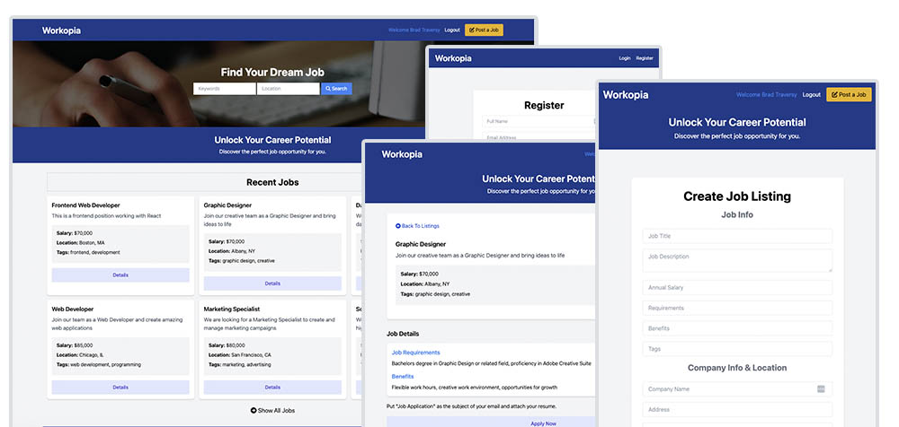

# Workopia - PHP Job Listing Application

A modern job listing platform built with PHP, featuring user authentication, job posting capabilities, and search functionality.



## 🚀 Features

- **User Authentication**: Register and login functionality with secure password hashing
- **Job Listings Management**: Create, edit, delete, and view job listings
- **Search Functionality**: Search through available job listings
- **Responsive Design**: Built with Tailwind CSS for mobile-friendly interface
- **MVC Architecture**: Clean separation of concerns with custom PHP framework
- **Database Integration**: MySQL database with PDO for secure data operations

## 🛠️ Technologies Used

- **Backend**: PHP 8+
- **Database**: MySQL
- **Frontend**: HTML5, Tailwind CSS
- **Architecture**: MVC (Model-View-Controller)
- **Security**: Password hashing, prepared statements
- **Package Management**: Composer

## 📋 Prerequisites

Before running this application, make sure you have the following installed:

- PHP 8.0 or higher
- MySQL 5.7 or higher
- Composer (PHP dependency manager)
- Web server (Apache/Nginx) or PHP built-in server

## 🔧 Installation

1. **Clone the repository:**

   ```bash
   git clone https://github.com/yourusername/workopia-php.git
   cd workopia-php
   ```

2. **Install PHP dependencies:**

   ```bash
   composer install
   ```

3. **Database Setup:**
   - Create a MySQL database named `workopia`
   - Update the database configuration in `config/db.php`:
     ```php
     return [
       'host' => 'localhost',
       'port' => '3306',
       'dbname' => 'workopia',
       'username' => 'your_username',
       'password' => 'your_password',
     ];
     ```

4. **Database Tables:**
   Create the following tables in your MySQL database:

   ```sql
   -- Users table
   CREATE TABLE users (
       id INT AUTO_INCREMENT PRIMARY KEY,
       name VARCHAR(255) NOT NULL,
       email VARCHAR(255) UNIQUE NOT NULL,
       city VARCHAR(255),
       state VARCHAR(255),
       password VARCHAR(255) NOT NULL,
       created_at TIMESTAMP DEFAULT CURRENT_TIMESTAMP
   );

   -- Listings table
   CREATE TABLE listings (
       id INT AUTO_INCREMENT PRIMARY KEY,
       user_id INT NOT NULL,
       title VARCHAR(255) NOT NULL,
       description TEXT,
       salary VARCHAR(50),
       tags VARCHAR(255),
       company VARCHAR(255),
       address VARCHAR(255),
       city VARCHAR(255),
       state VARCHAR(255),
       phone VARCHAR(50),
       email VARCHAR(255),
       requirements TEXT,
       benefits TEXT,
       created_at TIMESTAMP DEFAULT CURRENT_TIMESTAMP,
       updated_at TIMESTAMP DEFAULT CURRENT_TIMESTAMP ON UPDATE CURRENT_TIMESTAMP,
       FOREIGN KEY (user_id) REFERENCES users(id) ON DELETE CASCADE
   );
   ```

5. **Start the development server:**

   ```bash
   php -S localhost:8000 -t public/
   ```

6. **Access the application:**
   Open your browser and navigate to `http://localhost:8000`

## 📖 Usage

### For Job Seekers:

- Browse recent job listings on the homepage
- Use the search functionality to find specific jobs
- View detailed job information and requirements

### For Employers:

- Register for an account
- Login to access the dashboard
- Create new job listings with detailed information
- Edit or delete existing job postings

## 🏗️ Project Structure

```
workopia/
├── App/
│   ├── controllers/     # Controller classes
│   └── views/          # View templates
├── Framework/          # Custom MVC framework
├── config/            # Configuration files
├── public/            # Public web assets
│   ├── css/
│   └── images/
├── vendor/            # Composer dependencies
├── composer.json      # PHP dependencies
├── helpers.php        # Helper functions
└── routes.php         # Application routes
```

## 🔒 Security Features

- Password hashing using PHP's `password_hash()` function
- Prepared statements to prevent SQL injection
- Session-based authentication
- Input validation and sanitization

## 🤝 Contributing

1. Fork the repository
2. Create a feature branch (`git checkout -b feature/amazing-feature`)
3. Commit your changes (`git commit -m 'Add some amazing feature'`)
4. Push to the branch (`git push origin feature/amazing-feature`)
5. Open a Pull Request

## 👨‍💻 Author

**Abdulrahman Atma**

- Email: abdulrahmanetmeh@gmail.com

## 🙏 Acknowledgments

- Built following modern PHP development practices
- Inspired by popular job listing platforms
- Uses Tailwind CSS for responsive design
